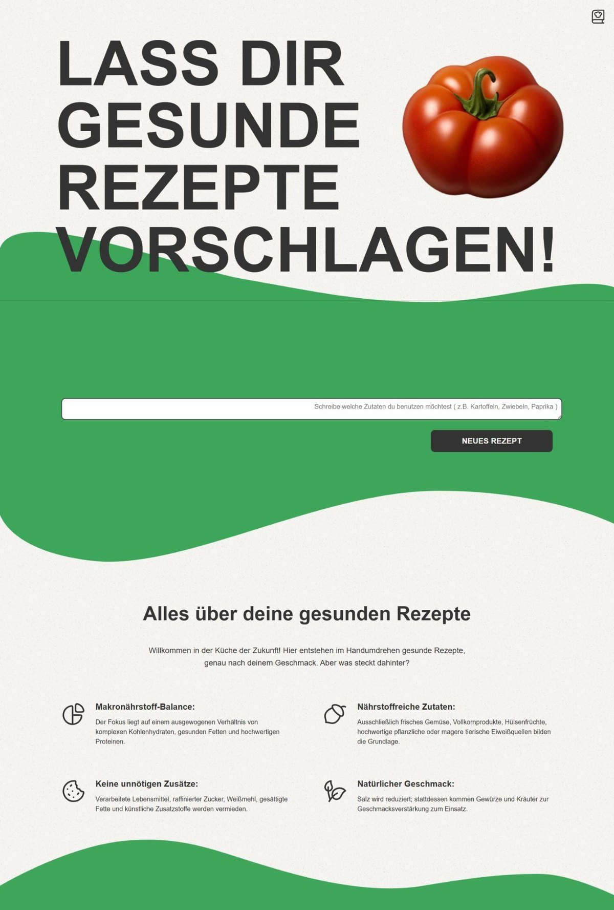
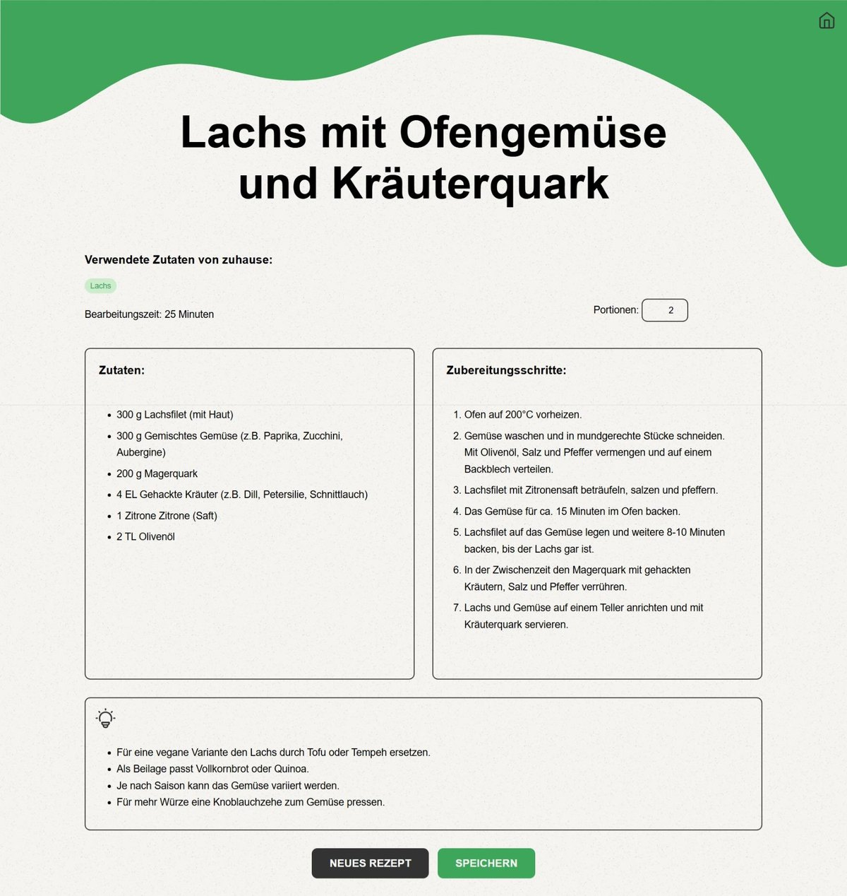
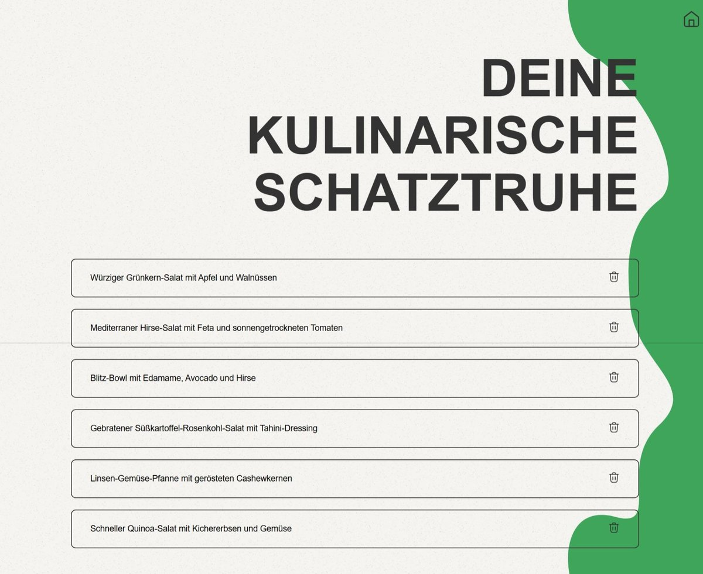
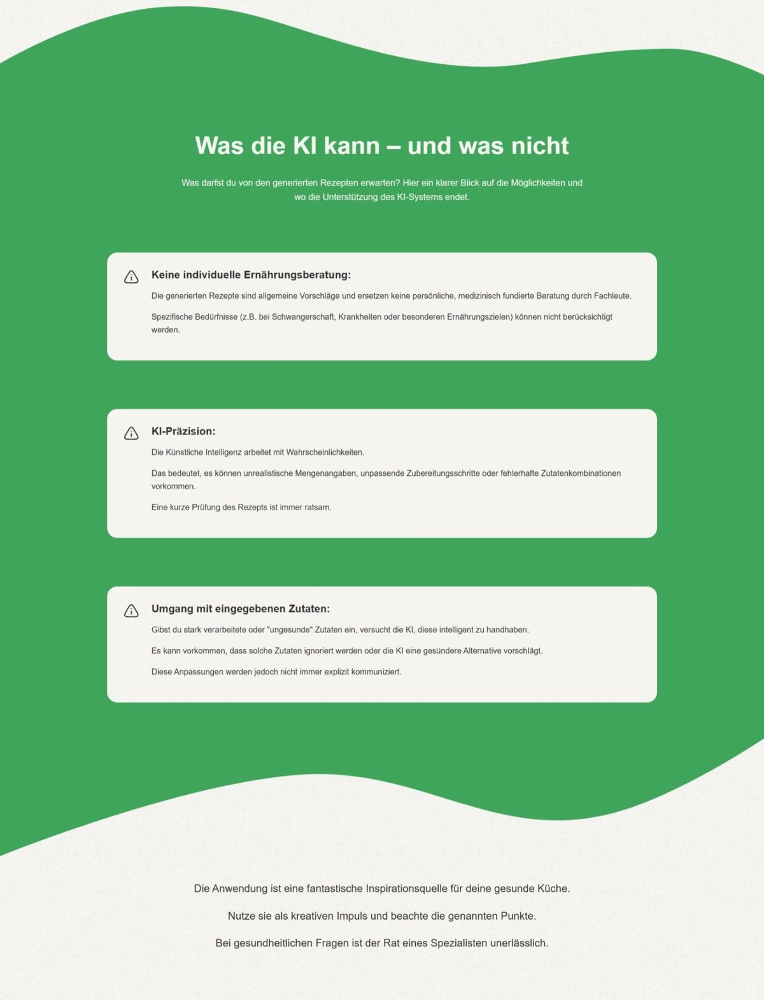
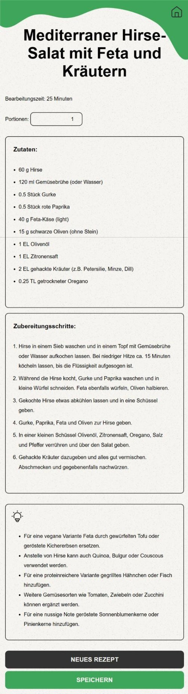
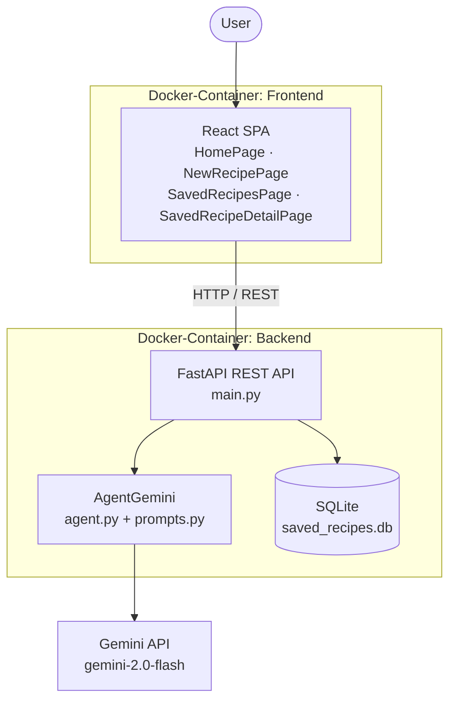

# Recipe Web App — KI-gestützte Vorschläge für gesunde Rezepte

Eine Webanwendung, die mit Hilfe eines Large Language Models automatisiert gesunde,
alltagstaugliche Rezepte generiert – optional auf Basis der Zutaten, die gerade zu Hause sind.

Entstanden als praktischer Teil der Bachelorarbeit **„Mit KI zu einer gesunden Ernährung:
Automatisierte Rezeptvorschläge für den Alltag“**.

<p align="center">
  
</p>

---

## Hintergrund

Studien identifizieren drei zentrale Hürden für eine gesunde Ernährung im Alltag: **fehlendes
Wissen** über gesunde Lebensmittel, ein **Gefühl des Kontrollverlusts** in Ernährungssituationen
und **Zeitmangel**. Die Anwendung setzt genau hier an: Statt Nutzer mit Ernährungstheorie zu
konfrontieren, ist das ernährungswissenschaftliche Regelwerk (DGE-/WHO-Empfehlungen) direkt in
den System-Prompt kodiert. Ein Klick genügt – das Ergebnis ist ein in maximal 30 Minuten
kochbares Rezept mit höchstens 10 Hauptzutaten.

### Modellauswahl per „LLM-as-a-Judge“

Die Wahl des Sprachmodells wurde nicht nach Gefühl getroffen, sondern messbar begründet.
Drei Modelle generierten je **60 Rezepte** mit identischem Prompt und Response-Schema. Zwei
unabhängige LLM-Bewerter (o3-mini und gemini-2.0-flash) beurteilten jedes Rezept blind – die
Herkunft wurde verschwiegen, um Self-Preference-Bias zu vermeiden.

| Kriterium           | Gewichtung |
| ------------------- | ---------- |
| Kohärenz            | ×1,5       |
| Gesundheit          | ×1,5       |
| Rezeptvielfalt      | ×1,5       |
| Kreativität         | ×1,0       |
| Umsetzbarkeit       | ×1,0       |
| Alltagstauglichkeit | ×1,0       |

| Modell                     | Gesamtpunktzahl (beide Bewerter) |
| -------------------------- | -------------------------------- |
| **gemini-2.0-flash**       | **122,384** ← ausgewählt         |
| o3-mini-2025-01-31         | 121,207                          |
| claude-3-7-sonnet-20250219 | 119,616                          |

Alle drei Modelle erwiesen sich als grundsätzlich geeignet; die Unterschiede sind gering.
`gemini-2.0-flash` erreichte die höchste kombinierte Wertung und wird in der Anwendung eingesetzt.

---

## Features

| Feature                      | Beschreibung                                                                                                  |
| ---------------------------- | ------------------------------------------------------------------------------------------------------------- |
| **KI-Rezeptgenerierung**     | Ein Klick erzeugt ein vollständiges, ausgewogenes Rezept für Mittag- oder Abendessen                          |
| **Zutatenbasierte Suche**    | Optionale Eingabe vorhandener Zutaten (z. B. „Kartoffeln, Zwiebeln, Paprika“), die im Rezept verwendet werden |
| **Kurzfristige Varianz**     | Die Titel der letzten 7 Rezepte werden dem Prompt beigefügt, damit sich Vorschläge nicht wiederholen          |
| **Portionsanpassung**        | Mengenangaben werden proportional zur gewählten Portionszahl neu berechnet                                    |
| **Tipps & Varianten**        | Jedes Rezept liefert vegane/vegetarische Alternativen und Ersatzzutaten                                       |
| **Kulinarische Schatztruhe** | Persönliche Sammlung gespeicherter Rezepte mit Detailansicht und Löschfunktion                                |
| **Responsive Design**        | Abgestufte Layouts für Desktop, Tablet (≤ 1024 px) und Mobilgeräte (≤ 768 px)                                 |
| **Strukturierte Ausgabe**    | Pydantic-Response-Schema erzwingt ein konstantes JSON-Format der Modellantwort                                |

---

## Screenshots

<table>
  <tr>
    <td width="50%" valign="top">
      <br>
      <sub><b>Rezeptansicht</b> — Zutaten, Schritt-für-Schritt-Anleitung, Tipps und Portionsregler</sub>
    </td>
    <td width="50%" valign="top">
      <br>
      <sub><b>Deine kulinarische Schatztruhe</b> — gespeicherte Rezepte verwalten</sub>
    </td>
  </tr>
  <tr>
    <td width="50%" valign="top">
      <br>
      <sub><b>Transparenz</b> — die Startseite benennt offen, wo die KI-Unterstützung endet</sub>
    </td>
    <td width="50%" valign="top" align="center">
      <br>
      <sub><b>Mobile Ansicht</b> — Inhaltsblöcke stapeln sich vertikal</sub>
    </td>
  </tr>
</table>

---

## Architektur

Klassische Client-Server-Architektur, in zwei Docker-Containern bereitgestellt.



### Projektstruktur

```
recipe_web_app/
├── backend/                     # FastAPI-Service
│   ├── main.py                  # REST-Endpunkte
│   ├── agent.py                 # AgentGemini – Anbindung der Gemini API
│   ├── prompts.py               # System-Prompt + dynamische Erweiterungen
│   ├── schemas.py               # Pydantic-Modelle / Response-Schema
│   ├── db.py                    # SQLite-Zugriff
│   └── Dockerfile
├── frontend/react-frontend/     # React SPA
│   ├── src/pages/               # Startseite, Rezept, Schatztruhe, Detailansicht
│   ├── src/api.js               # zentraler API-Client
│   └── Dockerfile               # Multi-Stage-Build → Nginx
├── deploy.yml                   # Docker-Compose-Definition
├── deploy.sh                    # Deployment-Skripte
└── docs/                        # Screenshots
```

### Tech-Stack

| Ebene    | Technologie                                               |
| -------- | --------------------------------------------------------- |
| Frontend | React 18, React Router 6, CRA, Nginx (Auslieferung)       |
| Backend  | Python 3.13, FastAPI, Pydantic                            |
| KI       | Google Gemini API (`gemini-2.0-flash`) via `google-genai` |
| Daten    | SQLite                                                    |
| Betrieb  | Docker, Docker Compose                                    |

---

## Datenmodell der Rezepte

Das Response-Schema (`backend/schemas.py`) garantiert eine gleichbleibende Struktur der
Modellantwort und macht sie ohne Nachbearbeitung weiterverwendbar:

```python
class RecipeFormat(BaseModel):
    titel: str
    portionen: int
    zubereitungszeit: str
    zutaten: list[IngredientsFormat]      # menge: float, einheit: str, zutat: str
    zubereitungsschritte: list[str]
    tipps: list[str]
```

---

## Setup

### Voraussetzungen

- Docker und Docker Compose (empfohlen) **oder** Python 3.13 + Node.js 18
- Ein API-Key für die Google Gemini API

### API-Key konfigurieren

Im Ordner `backend/` eine Datei `.env` anlegen:

```bash
GEMINI_API_KEY=dein-api-key
```

### Variante A — Docker (empfohlen)

```bash
docker compose -f deploy.yml up --build -d
```

Frontend: <http://localhost:3000> · Backend: <http://localhost:81> ·
API-Docs: <http://localhost:81/docs>

Für ein vollständiges Neu-Deployment (Container stoppen, alte Images entfernen, neu bauen):

```bash
./deploy.sh
```

Unter Windows steht `deploy.ps1` mit identischer Funktion zur Verfügung.

### Variante B — lokale Entwicklung

Backend:

```bash
cd backend && pip install -r requirements.txt && fastapi dev main.py --port 81
```

Frontend:

```bash
cd frontend/react-frontend && npm install && npm start
```

> **Hinweis:** `frontend/react-frontend/src/api.js` enthält die Backend-URL als Konstante
> (`API_BASE_URL`). Für den lokalen Betrieb dort auf `http://localhost:81` umstellen.

---

## API-Endpunkte

| Methode | Endpunkt                            | Beschreibung                                                               |
| ------- | ----------------------------------- | -------------------------------------------------------------------------- |
| `GET`   | `/`                                 | Health-Check, gibt die Version zurück                                      |
| `GET`   | `/generate_recipe`                  | Generiert ein Rezept ohne Zutatenvorgabe                                   |
| `POST`  | `/generate_recipe_with_ingredients` | Generiert ein Rezept aus vorgegebenen Zutaten (`{"ingredients": ["..."]}`) |
| `GET`   | `/get_saved_recipes`                | Liefert alle gespeicherten Rezepte                                         |
| `POST`  | `/save_recipe`                      | Speichert ein Rezept dauerhaft                                             |
| `POST`  | `/delete_recipe`                    | Löscht ein Rezept anhand seines Titels                                     |

---

## Grenzen der Anwendung

Die Anwendung ist eine **Inspirationsquelle, kein Ersatz für Ernährungsberatung**. Bewusst
transparent gehalten und auch in der App selbst kommuniziert:

- **Keine medizinische Beratung.** Individuelle Faktoren wie Alter, Geschlecht, Aktivitätsniveau,
  Schwangerschaft oder chronische Erkrankungen (Diabetes, Zöliakie, Unverträglichkeiten) werden
  nicht berücksichtigt.
- **KI-Präzision.** Mengenangaben und Zubereitungsschritte sind in der Regel plausibel, können
  aber Ungenauigkeiten enthalten – eine kurze Prüfung vor dem Kochen ist ratsam.
- **Eingegebene Zutaten werden nicht bewertet.** Bei stark verarbeiteten Zutaten ignoriert das
  Modell diese teils stillschweigend oder deutet sie um (z. B. „Schokolade“ → Zartbitterschokolade),
  ohne dies explizit zu kommunizieren.

---

## Über dieses Projekt

Praktischer Teil einer Bachelorarbeit. Die vollständige Arbeit – inklusive der
ernährungswissenschaftlichen Grundlagen, des Modellvergleichs und der Designdokumentation –
ist nicht im Repository enthalten.
